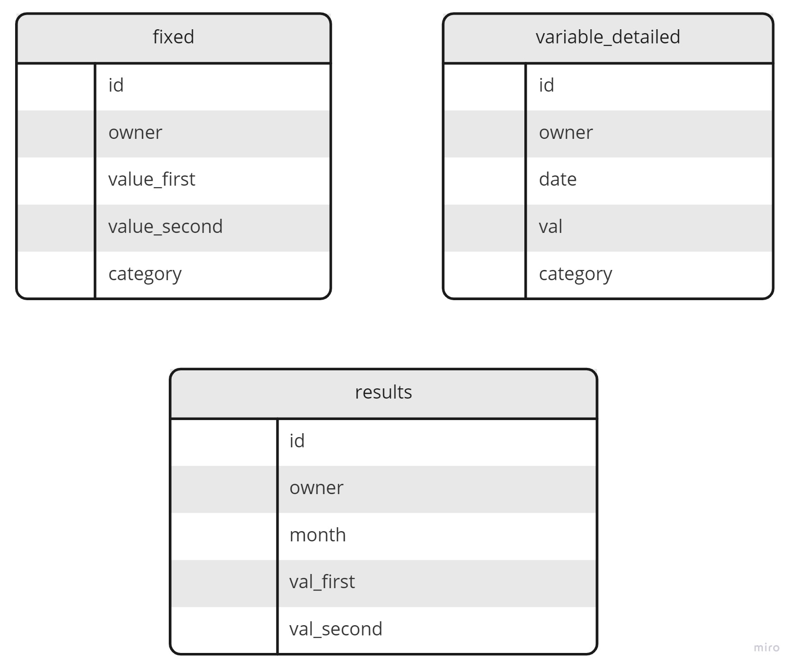

# WhatsApp record finance BOT

This is a simple whatsapp bot to record, in a PostgreSQL database, incomes and expenses made with FastAPI.
The structure of the database is described below.

The bot have the following syntax:

* to add a fixed income/expense: `fixo FLOAT categoria:CATEGORY where:{FIRST,SECOND}`
* to add a variable income/expense `FLOAT CATEGORY`

## Structure

The database has the following structure:



I chose to split the month in two for every expense or income -- the `first` or the `second` half.

The `results` database is composed as the sum of the incomes/expenses in the `variable_detailed`
and the `fixed` databases, and is filled whenever a new line in `variable_detailed` is created,
due to the trigger (in `variable_detailed`):

```
create trigger trigger_value_added_variable
    after insert
    on variable_detailed
    for each row
execute procedure add_to_results();
```

The funcion `add_to_results` is in the file `add_to_results.plpgsql`
